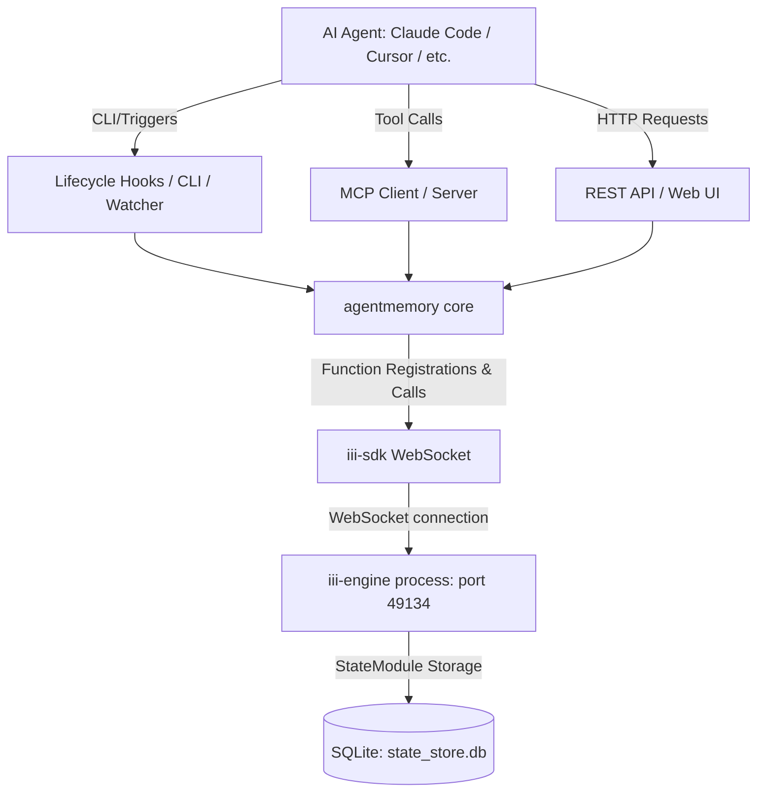

# Master Context: agentmemory

This file serves as the **single source of truth** for the `agentmemory` project, covering overall architecture, tech stack, active features, and key decisions.

---

## 🏗️ Overall Architecture

`agentmemory` is a persistent memory system for AI coding agents. It does not run a standalone database in-process; instead, it is built entirely on the **iii-engine** platform using three primitives: Workers, Functions, and Triggers.

### System Architecture Flow



### Key Architectural Concepts
1. **Engine Integration**: Communication with `iii-engine` is handled via `iii-sdk` over a WebSocket connection on port 49134.
2. **State Management**: State is persisted in `./data/state_store.db` using the `StateModule` of `iii-engine`. Core functions use the `kv.get`, `kv.set`, and `kv.list` APIs.
3. **Double Proxying**: The standalone MCP server proxies to the active main server so that hooks, API calls, and the Web Viewer share a consistent memory state.

---

## 🛠️ Tech Stack

- **Runtime**: Node.js (>= 20.0.0)
- **Language**: TypeScript (Strict Mode)
- **Module System**: ESM (`"type": "module"`)
- **Engine**: `iii-sdk` (^0.11.2) communicating with `iii-engine` (pinned to `v0.11.2`)
- **Build Tool**: `tsdown` (outputs to `dist/`)
- **Test Framework**: Vitest

---

## 🚀 Active Features (v0.9.11)

1. **MCP Server**: Provides 44 active MCP tools (up to 51 when extended), 6 resources, 3 prompts, and 4 skills.
2. **REST API**: Provides over 104 HTTP endpoints on port 3111 (e.g., `/agentmemory/remember`, `/agentmemory/smart-search`).
3. **Lifecycle Hooks**: 12 hooks (such as `PostToolUse`, `SessionStart`, `Stop`) capturing agent interactions automatically.
4. **4-Tier Memory Consolidation**:
   - *Working Memory*: Raw tool-use logs.
   - *Episodic Memory*: Compressed session summaries.
   - *Semantic Memory*: Extracted facts and patterns.
   - *Procedural Memory*: Decision patterns and workflows.
5. **Hybrid Search**: RRF (Reciprocal Rank Fusion) of BM25, dense Vector (local or cloud providers), and Knowledge Graph traversals.
6. **Real-Time Viewer**: Web dashboard running on port 3113, featuring a session explorer, graph visualizer, and chronological timeline replay.

---

## 🔑 Key Decisions

- **iii-engine Pinned Version**: `iii-engine` is pinned to `v0.11.2` because `v0.11.6+` introduces a sandboxed worker model that has not yet been integrated.
- **Local Embeddings**: `@xenova/transformers` with `all-MiniLM-L6-v2` is used for free, offline, local vector calculations to improve semantic search.
- **Privacy Enforcement**: API keys, credentials, and tags matching `<private>...</private>` are stripped at the boundaries before database writes.
- **Audit Trails**: Every state-changing operation (like deletes) registers an entry in the audit trail using `recordAudit()`.

---

## 💻 Code Patterns & Examples

### 1. Function Registration

Functions must be registered through the `iii-sdk`.

#### ✅ DO
```typescript
import { sdk } from "iii-sdk";
import { recordAudit } from "../state/audit.js";

sdk.registerFunction(
  "mem::save-insight",
  async (data: { insight: string; sessionId: string }) => {
    if (!data.insight) throw new Error("Insight is required");
    
    const timestamp = new Date().toISOString();
    await sdk.kv.set(`insight:${data.sessionId}`, {
      content: data.insight,
      createdAt: timestamp,
    });
    
    await recordAudit({
      operation: "insight_create",
      sessionId: data.sessionId,
      timestamp,
    });
    
    return { success: true };
  }
);
```

#### ❌ DON'T
```typescript
// Do not bypass the iii-sdk to write directly to a local SQLite file in-process
import sqlite3 from "sqlite3";

const db = new sqlite3.Database("./local.db");
db.run("INSERT INTO insights VALUES (?)", [insight]); // BAD! Bypasses iii-engine
```

### 2. REST Endpoint Registration & Security

REST endpoints must whitelist fields from the request body before invoking the engine function.

#### ✅ DO
```typescript
sdk.registerFunction("api::save-insight", async (req: ApiRequest) => {
  const denied = checkAuth(req, secret);
  if (denied) return denied;

  const body = req.body as Record<string, unknown>;
  // Whitelist fields
  const payload = {
    insight: String(body.insight || ""),
    sessionId: String(body.sessionId || ""),
  };

  const result = await sdk.trigger({
    function_id: "mem::save-insight",
    payload,
  });
  return { status_code: 200, body: result };
});

sdk.registerTrigger({
  type: "http",
  function_id: "api::save-insight",
  config: { api_path: "/agentmemory/insight", http_method: "POST" },
});
```

#### ❌ DON'T
```typescript
sdk.registerFunction("api::save-insight", async (req: ApiRequest) => {
  // BAD: Passing raw body directly to trigger without validation/whitelisting
  const result = await sdk.trigger({
    function_id: "mem::save-insight",
    payload: req.body, 
  });
  return { status_code: 200, body: result };
});
```

---

## 📝 Change Log

### [0.9.11] - 2026-05-20
- Created master `CONTEXT.md` in the project root to satisfy global repository standards.
- Verified test suite containing 877 test cases passing successfully.
